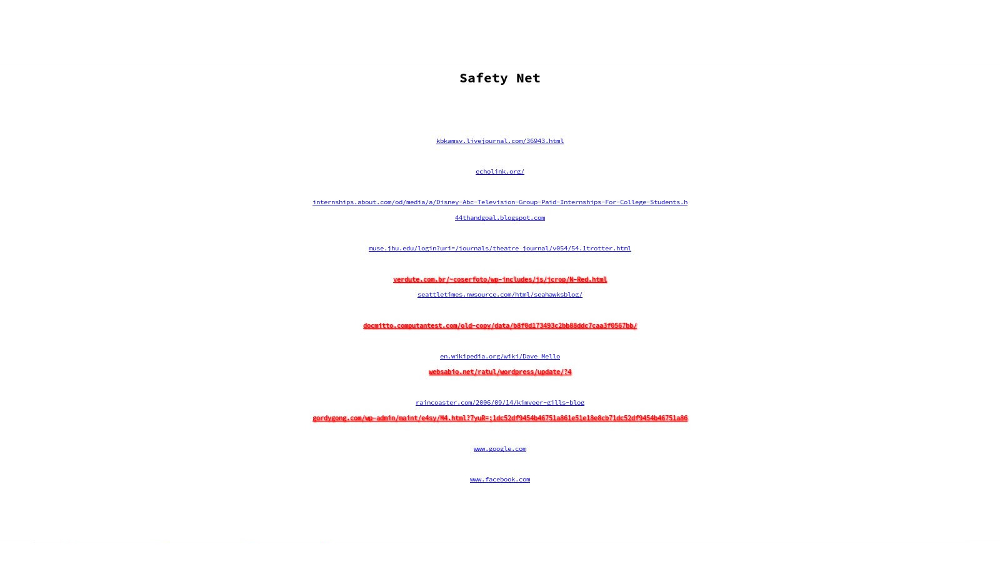

# Safety Net
Chrome/Firefox extension that uses recurrent networks to classify and warn you about HTML elements that are linked to malicious URLs.

Link to 

Example page with several links from the dataset.

