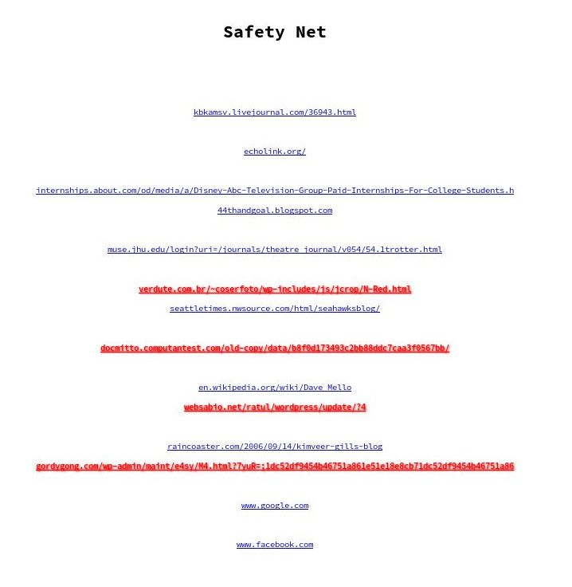

# Safety Net
Chrome/Firefox extension that uses recurrent networks to classify and warn you about HTML elements that are linked to malicious URLs. See our  for more details.

The recurrent neural network was trained using 

Example page with several malicious/safe links.

